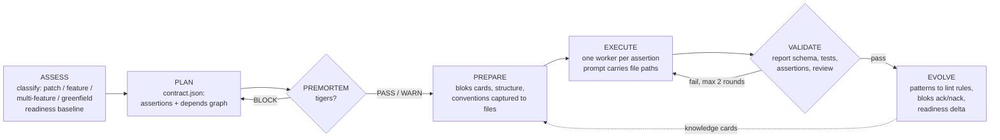
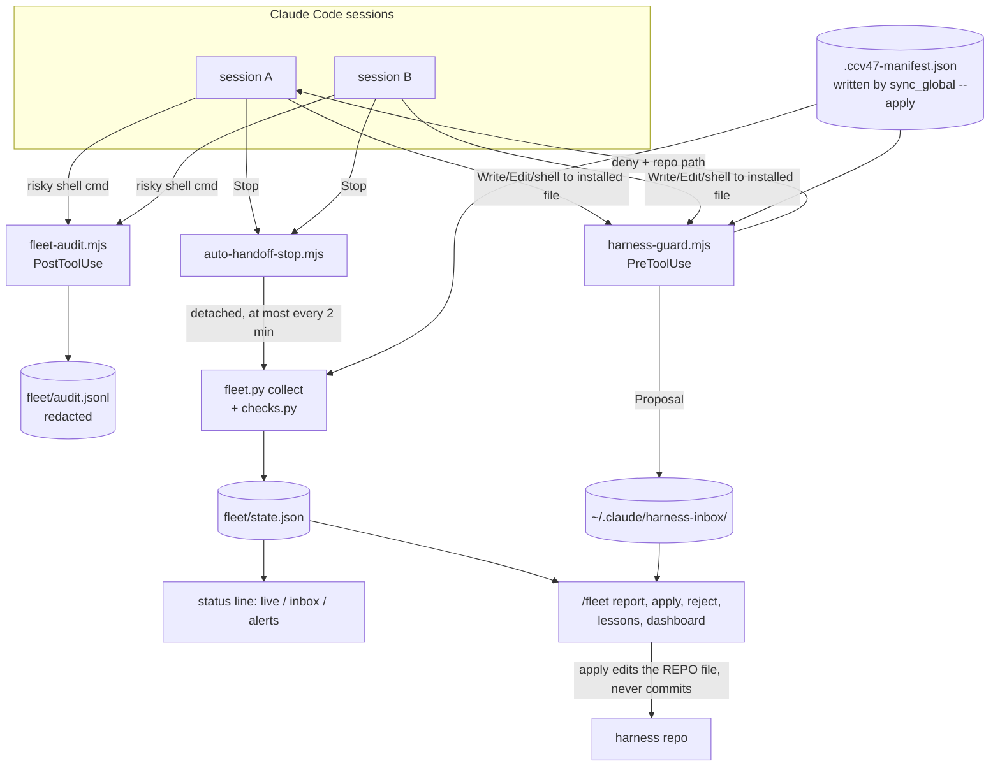

# Continuous Claude v4.7: a project explainer

**Repository:** [github.com/maren-epochs/ContinuousClaudeV4.7](https://github.com/maren-epochs/ContinuousClaudeV4.7) (MIT)\
**Maintainer of this fork:** maren-epochs\
**Upstream:** [parcadei/ContinuousClaudeV4.7](https://github.com/parcadei/ContinuousClaudeV4.7)

**Reading guide.** Two minutes: the Summary, "At a glance" and "Status". Twenty minutes: add section 3 (defects found in the hooks), section 6 (fleet control, a full build from data contract to review rounds) and section 8 (decisions and open problems).

## Summary

Continuous Claude v4.7 is a harness for [Claude Code](https://docs.anthropic.com/en/docs/claude-code), Anthropic's agentic coding command-line tool. It adds three layers on top of a plain Claude Code session: workflow skills that run a structured software lifecycle (assess, plan, failure analysis, prepare, execute, validate, evolve), lifecycle hooks that enforce rules the model cannot be trusted to follow on its own (context budgets, lint after edits, write protection for installed files, an audit trail of risky shell commands), and a set of stdlib Python tools (a sandboxed research REPL bridge, report and contract validators, a privacy guard, a context-token ledger, a charting toolkit and a cross-session "fleet" monitor).

The upstream project, written by parcadei, shipped on 2026-04-21 as a single release commit: nine skills, two agents, five hooks, a readiness scorer and the Ouros sandbox bridge. The pipeline design described in section 2 (orchestrator and workers, validation contract, premortem, knowledge cards, handoffs) is upstream's. As of commit `5e9834a` (2026-10-07), this fork adds 160 commits (152 excluding merges) made between 2026-09-20 and 2026-10-07; against the upstream release it changes 166 files (47,041 lines added, 2,068 removed). The fork's work falls into four groups: fixing defects in the upstream harness, so that pieces which looked like they worked actually did; hardening the sandbox and hooks for Windows and for adversarial input; adding a test, lint, type-check and CI layer the upstream release did not have; and building two new subsystems, a visualization toolkit and fleet control.

**Role and how it was built.** maren-epochs chose what to change, set the acceptance criteria, made the trade-off decisions, reviewed the output, and ran the live checks against Claude Code. Most of the code was written by Claude agents running inside this same harness: 151 of the 152 non-merge fork commits carry a `Co-Authored-By: Claude ...` trailer (the remaining one is a hand-made settings change). The division of labor is visible in tracked files: `continuum/research/harness-review-2026-10-05/decision-queue.md` shows agents queuing options with a recommendation and the maintainer's decisions applied afterwards, commit messages mark choices as "user decision", and the seven upstream pull requests (section 8) are opened under the maintainer's handle. This is stated plainly because it is part of what the project demonstrates: a way of directing AI coding agents so that their output is tested and reviewed rather than taken on trust.

**My role (maren-epochs), in specifics:**

- Set scope and acceptance criteria for each piece of work; for fleet control I chose the feature set (session view, write guard with a proposal inbox, one-command apply, risky-command audit, lesson sharing, dashboard) and which extras to defer.
- Made the trade-off calls the agents queued, e.g. the eight entries D1 to D8 in `decision-queue.md`, and for fleet control that the write guard blocks rather than only warns, and that a guard which cannot save its proposal still blocks.
- Reviewed agent output and sent work back: every fleet milestone went through a separate review pass, and findings (false denies in the guard, a 46-second redaction stall, a context meter about 5x too high on 1M-token windows) were fixed in tracked fix rounds before the milestone passed.
- Corrected the agents when they generalized past what I had decided; a rule an agent inferred on its own ("never interrupt other projects") was reverted.
- Kept privacy and publishing decisions with me: nothing that names other projects is tracked, and nothing is pushed without my review.
- [Author to confirm or edit: time invested, and any live probes or reworks done by hand.]

**Skills exercised:** agent workflow design, hook and tooling engineering in Node.js and Python, sandbox security (command parsing, path containment, secret denylists), Windows path semantics, test design (characterization tests, contract tests, shell-level hook suites), CI on Linux and Windows, data-contract design, and measurement-driven decisions.

### At a glance

| Area | What the fork did | Where to check |
|------|-------------------|----------------|
| Defects in upstream hooks | Fixed a context meter off by about 22 points, a stop guard inactive in headless runs, auto-handoffs that were always empty, and a linter that reported undefined names as clean | section 3; `git log -- .claude/hooks` |
| Sandbox security | Closed a shell-injection path and secret reads through allowed commands; policy pinned by 57 tests | section 4; `tools/test_ouros_*.py` |
| Test and CI layer | 913 pytest tests, about 450 shell-level hook checks, ruff, mypy, a pre-commit privacy guard, CI on Linux and Windows | section 7 |
| New subsystems | Visualization toolkit (305 tests); fleet control: cross-session monitor, write guard for installed files, risky-command audit (built in one day across 11 tracked assertions) | sections 5 and 6 |
| Decisions | Measured before optimizing, verified platform behavior live and recorded the version, documented what is unsolved | section 8 |

### Status

This block is the single place where current figures are kept; the rest of the document refers to it.

- **Readiness score:** 23 of 27 criteria pass (level 5 of 5, 85.2%), from a run on 2026-10-07 after the fleet build. The repo had reached 27/27 at commit `161e58b`. The four failing criteria are all tldr code analyses: 11 clone pairs (threshold under 10), 13 severe-complexity functions (under 5), a 14.6% tech-debt ratio (under 10%) and 3 security-scan findings. A clean-up pass is in progress. Section 7.5 explains the scorer.
- **CI:** last green on commit `765bf31` (2026-10-07), on Linux and Windows. The fleet-control commits after it had not been pushed or run in CI when this was written.
- **Upstream pull requests:** seven (#13, #14, #16 to #20), open and unmerged when this was written.

### Terms used

| Term | Meaning here |
|------|--------------|
| Context window | The fixed amount of text the model can hold at once; a long session fills it |
| Compaction | Claude Code summarizing the conversation to free space, losing detail |
| Skill | A Markdown instruction file Claude Code loads on demand, here one per workflow |
| Hook | A small program Claude Code runs at fixed points (before or after a tool call, at stop) that can block or annotate the call |
| Worker / subagent | A separate Claude instance given one bounded task by the orchestrating session |
| Fail open / fail closed | On internal error, allow the action / block it |
| Handoff | A file recording session state so a later session can resume |

---

## 1. The problem

An agentic coding session is a long-running process with a fixed-size working memory (the context window), no persistent state between sessions by default, and the ability to run arbitrary shell commands on the user's machine. The failure modes follow from those three facts.

**Context loss.** When the window fills, Claude Code compacts the conversation into a summary, and detail is lost: the current assertion, the files already changed, the approaches already rejected.

**Drift.** Over a long task the model's working definition of "done" moves. Tests get weakened to pass, scope expands, conventions agreed early in the session are forgotten. Instructions in `CLAUDE.md` are probabilistic: usually followed, never guaranteed.

**Unsafe or unaccountable actions.** The agent can force-push, hard-reset, delete recursively, edit its own configuration or read credential files, and two sessions on one machine can edit the same file without either knowing.

**Unverified self-reports.** A subagent that says "tests pass" may not have run them.

The design response is consistent: wherever possible, a rule moves from an instruction to a deterministic mechanism (a hook, a validator, a lint rule, a test). The README states the order of preference: lint rule > type system > formatter > pre-commit hook > CI check > `CLAUDE.md` (last resort).

---

## 2. Architecture

### 2.1 Components at a glance

| Layer | Contents | Origin |
|-------|----------|--------|
| Skills (12) | `/autonomous`, `/autonomous-research`, `/research`, `/premortem`, `/bootup`, `/review`, `/create-handoff`, `/resume-handoff`, `/upgrade-harness` | upstream; several revised in the fork |
| | `/analyze-data`, `/visualize`, `/fleet` | fork |
| Agents (2) | `worker` (executes one bounded task), `oracle` (external research) | upstream; `worker` rewritten in the fork |
| Hooks (9 + helper) | `status`, `tldr-read`, `post-edit-diagnostics`, `pre-compact`, `auto-handoff-stop` | upstream, substantially fixed in the fork |
| | `session-start`, `worker-report-check`, `harness-guard`, `fleet-audit`, plus the `tldr-shim` helper | fork |
| Tools | `ouros_harness.py`, `exa_search.py`, `nia_docs.py`, `readiness.sh` | upstream, hardened in the fork |
| | `validate_report.py`, `privacy_guard.py`, `context_ledger.py`, `api_common.py`, `lock_requirements.py`, `tools/viz/`, `tools/fleet/`, `install/` | fork |

Skills are Markdown instruction files that Claude Code loads on demand. Hooks are dependency-free Node.js ES modules run at fixed lifecycle points (before and after tool calls, at stop, before compaction, for the status line); Node is present wherever Claude Code runs, so there is no build step. The Python tools are stdlib-only apart from the two web bridges (`aiohttp`) and the optional visualization stack.

### 2.2 Skills orchestrate, workers build

The central skill is `/autonomous`, whose first instruction is "Orchestrate. Never implement." The orchestrating session plans, delegates and validates; all code changes happen in `worker` subagents, each with one task, one assertion and one report file.



**The validation contract comes first.** PLAN writes `contract.json` before any code exists. Each assertion has an id (`VAL-001`), a type (`invariant`, `behavioral`, `contract`, `property`, `fuzz` or `approval`), a milestone, a dependency list, and empty `worker` and `evidence` fields. Ownership is fixed: PLAN creates the file, EXECUTE records which worker took which assertion, VALIDATE flips status and fills in evidence, and workers never touch it. Aesthetic work becomes an `approval` assertion that waits on a human decision. The decomposition rule is mechanical: if "and" is needed to describe the work, it is two tasks. The fork's own history follows the scheme: commit subjects carry assertion ids (`VAL-801` to `VAL-811` for the fleet build), 50 distinct ids in all.

**The premortem gate.** Before PREPARE, `/premortem` projects the plan forward to an imagined failure and reasons backward through six lenses (base assumptions, shortcuts, weak implementations, missing evaluations, necessity conditions, nth-order effects). Each risk is a tiger (real, needs mitigation), a paper tiger (looks threatening, bounded) or an elephant (an avoided systemic issue); a tiger with no mitigation path yields `BLOCK`. A falsifiability rule keeps the gate from becoming a list of vague worries: a risk that cannot name the check that would disprove it is demoted or discarded. The fork added a patch fast path: a single-assertion fix runs the premortem inline and auto-passes when there is no tiger, while the EVOLVE knowledge checklist still always runs.

**Context by reference.** In upstream, the `/autonomous` skill was one 282-line file, and worker prompts pasted the context they needed. The fork split it into a 72-line router plus `phases/*.md` files that are read only when the pipeline enters each phase. PREPARE writes each context capture to disk once (bloks output, `tldr structure`, a conventions excerpt), and worker prompts carry paths: about 50 tokens each, against thousands for a pasted capture repeated per worker. The commit records a 98% smaller prompt payload for a two-worker run.

**Uniform worker reports, schema-checked.** Every worker writes one JSON report with fixed fields: `task`, `assertion`, `result`, `implemented`, `tests`, `checks` (commands with exit codes), `bloks_used`, `corrections`, `discoveries`, `issues`, `conventions`. The fork added `tools/validate_report.py` (stdlib), and VALIDATE gates on it: missing fields, wrong types and out-of-enum values are errors, unknown fields are warnings, and `--contract` checks every report's assertion id against the contract. An invalid report gets one re-dispatch with the error lines; if still invalid, the orchestrator normalizes it and records that. Invalid data never reaches EVOLVE. The same validator runs from two hooks while the worker is active (section 3), and the skill text says which check binds: the hooks advise, the gate decides.

**Bounded fix loops.** A failed milestone gets at most two rounds of targeted fix workers, then escalates to the user; if the user declines, the milestone is reverted to its pre-milestone commit.

### 2.3 The knowledge loop

[bloks](https://github.com/maren-epochs/bloks) stores knowledge cards: library API notes, project rules, "taste" preferences and corrections. PREPARE injects relevant cards into worker context, workers mark each as helpful or not, and EVOLVE records corrections and new rules and runs `bloks ack` or `bloks nack` on every injected card. The upstream bloks (also by parcadei) is archived, and its scoring did not work: nack was never counted, feedback on library-less cards was dropped, and rule and taste cards were never scored, so EVOLVE's ack/nack step had no effect. The maren-epochs bloks fork fixed all three; one nack now hides a stale rule, and cards rank by a score in [-1, 1].

EVOLVE also aggregates `conventions`, `corrections` and `issues` across reports. A pattern seen three or more times becomes a recommendation at the strongest enforcement tier that can express it, and the user approves it before a worker applies it.

### 2.4 Handoffs

`/create-handoff` serializes session state (goal, current focus, decisions, open items, a context-cost summary) into a YAML file. `/resume-handoff` loads the newest one. Two hooks make this automatic (section 3). Handoffs go to the project's `thoughts/shared/handoffs/` if it already exists, else to `~/.claude/handoffs/<project>/`, so the harness never creates directories in a user's repository; the fork made every reader and writer resolve that root the same way.

---

## 3. The hooks layer

Hooks are where the "deterministic over probabilistic" principle is implemented. All of them follow one contract: never throw, always emit valid hook JSON, and fail open on unusable input. The exception is harness-guard, which fails closed once it has identified a protected target (section 6).

| Hook | Event | Function |
|------|-------|----------|
| `status.mjs` | statusLine | context %, git branch and change counts, goal from the newest handoff, fleet summary |
| `auto-handoff-stop.mjs` | Stop | blocks the session from stopping at 85% context so a handoff gets written; triggers the fleet collector |
| `pre-compact.mjs` | PreCompact | writes an auto-handoff before compaction |
| `session-start.mjs` | SessionStart (opt-in) | after compaction, injects the newest handoff in place of the lossy summary |
| `tldr-read.mjs` | PreToolUse:Read | for large code files, injects a structural map (functions, classes, line numbers) and truncates the read |
| `post-edit-diagnostics.mjs` | PostToolUse | lint after every edit |
| `worker-report-check.mjs` | PostToolUse + worker SubagentStop | validates report JSON while the worker is still running |
| `harness-guard.mjs` | PreToolUse | denies writes to installed harness files and files the intended change as a proposal |
| `fleet-audit.mjs` | PostToolUse:Bash\|PowerShell | logs risky shell commands, with secrets redacted |

Several of the fork's most consequential changes fixed upstream hooks that appeared to work but did not (each is in the commit history):

- **The context meter double-counted.** `status.mjs` added a fixed 45K-token overhead to a number that already included the system prompt and tools, about 22 points on a 200K window, so the 85% stop guard fired at about 62% real usage. It now reads Claude Code's own `used_percentage`.
- **The stop guard was inactive where it mattered most.** Headless runs and spawned agents have no status line, so the guard's input file was never written; it now falls back to the last main-thread usage in the transcript.
- **Auto-handoffs were empty.** The `pre-compact.mjs` matchers did not fit the real transcript schema, so every auto-handoff was an empty skeleton. It now parses the actual schema, reading backward from the end of the file.
- **Lint reported broken code as clean.** Every ruff finding was mapped to "warning", so an undefined name (F821) reported "0 errors". Broken-code codes are now errors, and Python goes straight to ruff (about 70 ms, against about 2 s through `tldr diagnostics`, per the hook header).
- **Path rules never matched on Windows.** `tldr-read.mjs` bypass regexes never matched backslash paths. The hook also auto-approved reads of large code files anywhere on disk, skipping the permission prompt a plain Read outside the project gets; it now auto-approves only inside the launch directory.

**Latency engineering.** Hooks run synchronously on every matching call. The fork added a modification-time cache to `tldr-read` (warm reads from 2.2 s to about 100-155 ms, per the commit) and an opt-in shim, `tldr-shim.mjs`, that keeps one `tldr-mcp` process alive behind a localhost socket to avoid a roughly 2 s CLI start-up on cold reads. Every fast path fails open to the slow one.

**Spawn filtering, and its limits.** Claude Code hooks can carry an `if` field holding a single permission rule (for example `"if": "Read(*.py)"`); when it does not match, Node never starts. The install template narrows `tldr-read` to the 23 code extensions it handles. Live probes showed the limits: an `if: Edit(...)` filter on the report check fired on Edit but not on Write, and workers create reports with Write, so the check never ran on report creation. That entry is now unfiltered and the hook filters by path itself (about 80 ms when there is nothing to check). The same kind of probe drove a larger decision for the fleet hooks (section 6).

---

## 4. Sandboxed research REPL

`/research` and `/autonomous-research` use [Ouros](https://github.com/parcadei/ouros) (by parcadei), a sandboxed Python REPL with save, fork and resume. `tools/ouros_harness.py` bridges it to external functions: web search (Exa), documentation search (Nia), LLM calls, agent calls, filesystem reads, and allowlisted shell commands. Research data stays in the REPL heap and only printed output enters the agent's context; sessions can be resumed or forked for parallel branches. A bridge that gives sandboxed code host access is a security boundary. The upstream bridge had exploitable gaps, closed in several review-driven passes.

**Command execution.** Upstream matched a command-prefix allowlist and then ran the command with `shell=True`, so `git log & <anything>` ran arbitrary host commands. The fork tokenizes the command and runs it with `shell=False`; unquoted `& | ; < > ( )`, newlines and NUL are rejected; the allowlist matches leading argv words (`git log/diff/show/blame`, `rg`, `cargo test`, `python -m pytest` and a few more); arguments that execute or write (`rg --pre`, `git --output`, `--ext-diff`, `--textconv`) are denied. Agents are spawned only through `agent_call`, which passes `--max-turns`.

**Secrets read through allowed commands.** A second review found that allowed commands could still read secrets through their path arguments: `git diff --no-index NUL .env` printed the file. Path-like arguments (plain tokens, `--opt=value`, `rev:path`, `path:stream`) are now checked against the secret denylist and read roots, `--no-index` and `--contents` are denied, recursive `grep` and `rg` get secret-file exclusions injected, and NTFS alternate data streams (`.env:x`) match the base name. The new tests fail on the previous version.

**The read policy.** `read_file` and `glob_files` allow only the project, the sandbox temp area and `OUROS_DATA_ROOTS`, checked after resolving symlinks and `..`; a root that resolves to home or a drive root grants nothing. Credentials are never readable, even under an allowed root: `.env*` (except `.example`, `.sample` and `.template`), `*.pem`, `*.key`, `id_*` keys, `~/.claude.json`, `~/.claude/.credentials*`, `~/.ssh`, `~/.aws`. `write_file` writes only to a fixed output root.

**Outbound requests.** `llm_call` posts only to an endpoint allowlist: HTTPS on port 443 to `api.anthropic.com`, `api.openai.com` or `openrouter.ai`, and plain HTTP only to loopback port 1234. It refuses redirects, so authorization headers never follow a redirect to another host.

**The deliberate exception.** `run_python` runs arbitrary code on host CPython so pandas and matplotlib are usable from research sessions. CLAUDE.md records why this is not an escalation (the agent already has Bash) and how it is bounded: a per-session working directory, one concurrent run, and a timeout that kills the process tree.

The policy is pinned by 57 tests in `tools/test_ouros_policy.py` and `tools/test_ouros_security_table.py`; the table test enumerates the policy so a refactor cannot loosen it silently, and later complexity refactors of the bridge left it unchanged.

---

## 5. Visualization toolkit

`tools/viz/` (about 5,100 lines, 305 tests) is a charting layer driven by the `/visualize` skill, which fixes the order of decisions: form, color, validate, marks, hover, accessibility, render and look, anti-pattern check. Color is never chosen first.

| Module | Role |
|--------|------|
| `palette.json` + `palette.py` | the only source of colors and fonts: categorical, sequential, ordinal (bounded levels), diverging, status, gray de-emphasis; emits CSS tokens. No hex literals anywhere else |
| `validate_palette.py` | six-check palette validator (OKLCH lightness band, chroma floor, color-vision-deficiency separation under simulated protan/deutan, and others), vendored verbatim from a dataviz skill, with byte-identity asserted by a test, plus an adapter |
| `recommend.py` | picks a chart form from the data's job (magnitude, change over time, distribution, part-to-whole, ranking, and so on) or its column profile; refuses dual axes (recommends small multiples), pies past five slices, more than eight categorical series |
| `style.py` | one house style for matplotlib/seaborn, plotly, altair, bokeh and great_tables |
| `export.py` | `save(fig, path, formats)` across six libraries; HTML rendered through headless Playwright Chromium, which waits on a `window.__chartsReady` signal; falls back to Chromium when kaleido fails |
| `artifact_page.py` | self-contained interactive pages from Plotly, Vega-Lite or ECharts specs, with tokens on `:root`, dark mode and a table view |

Chart specs reference palette tokens by name (`token('series-1')`), so light and dark mode come from one spec. The skill loads the toolkit under its own import name, `ccv_viz`, because a user project's own `tools/` package would otherwise shadow `tools.viz`; a test byte-compares that prelude. One known dependency conflict (`plotly-resampler` declares `plotly<7` but works on 7) is kept out of the lock and installed with `--no-deps`, with the reason documented at the declaration.

---

## 6. Case study: fleet control

The newest subsystem, built across assertions VAL-801 through VAL-811 on 2026-10-07, answers two questions for someone running several Claude Code sessions on one machine: what is every session doing, and how can sessions be stopped from silently changing the shared harness installation.



### 6.1 Data contract first

The first commit of the build was `tools/fleet/schema.md`, a 290-line contract for every fleet file, with `model.py` (stdlib dataclasses, JSON round trip). The parsing rules assume inputs (Claude Code's own session files and transcripts) that change without notice:

- Every key is optional; a missing or wrong-typed value takes the default, and booleans never count as numbers or the reverse.
- Unknown keys are kept in an `extra` map and written back unchanged, so a newer writer's fields survive an older reader.
- Missing expected fields in Claude Code's files raise a `schema_unknown` alert, not a crash.
- Writers emit strict JSON (`NaN` and `Infinity` raise) because the Node hooks read the same files.
- Proposal ids match a strict pattern and reject Windows device names (`CON`, `NUL`, `COM1`, in any case, with or without an extension).

### 6.2 Install manifest

`install/sync_global.py --apply` writes `~/.claude/.ccv47-manifest.json` by atomic replace: each installed path, its repo path, the sha256 of the installed bytes (after path rewriting and line-ending normalization), and a `kept` flag for user-pinned paths. Drift detection compares current hashes against it, and also detects a stale manifest left by an `--apply` that failed partway.

### 6.3 harness-guard: path normalization on Windows

`harness-guard.mjs` denies any write whose target resolves to a non-kept manifest entry. That covers the file tools and shell write targets (`>`, `>>`, `&>`, `tee`, `cp`, `mv`, `Copy-Item`, `Set-Content`, `Out-File` and others). The deny names the repo file to change instead, and the intended change is saved as a Proposal in the harness inbox for `/fleet apply`. The difficult part is deciding whether two path strings name the same file on Windows. The guard handles:

- `~`, `$HOME`, `${HOME}`, `$env:NAME` and `%NAME%` expansion, with PowerShell's `$HOME` treated as the profile directory;
- Git Bash `/c/...` form, backslashes, relative paths, and case-insensitive comparison on win32;
- `cd`, `pushd`, `popd` and `Set-Location` earlier in the same command, which move the base for relative targets;
- shell syntax that resembles redirection but is not: quotes, heredocs, PowerShell here-strings, `#` and `<# #>` comments, `[[ ]]`, `(( ))`, `$(( ))`, and PowerShell common parameters, aliases and unambiguous prefixes;
- **8.3 short names** (`PROGRA~1`-style aliases that Windows keeps for long names). When the lexical form is under `~/.claude` or contains a `~N` component, the guard resolves the deepest existing parent with `realpath.native`. Tests cover a short-name target against a long-name home and the reverse.

The guard never touches UNC or network paths on disk, caps stored change strings at 256 KiB, and redacts home paths, the username and private terms from stored commands.

**Fail-open policy, stated precisely.** Malformed input, a missing manifest or a parse error allows the call and logs to `~/.claude/fleet/guard-errors.log`. Once a managed target is identified, the write is denied even if saving the proposal fails. A broken guard cannot block unrelated work, and a broken proposal store cannot let a protected write through.

### 6.4 The live finding: `if` filters miss 8.3 spellings

The natural design was to register the guard with an `if` filter such as `Write(~/.claude/**)` so that Node starts only for writes under `~/.claude`. A headless live check against Claude Code 2.1.293 showed that the CLI normalized `/c/...`, `~`, forward slashes and case before matching, but did not match an 8.3 short-name spelling of the same path. With the filter in place, a write to a protected file through its short name would have skipped the guard entirely.

The decision, recorded in `install/register_hooks.py`, `install/README.md` and CLAUDE.md, was to register both fleet hooks with no `if` filter and normalize inside the hook, at the cost of a Node start on every file and shell call. That cost was measured: the guard's test suite ends with a benchmark (p50 of 20 runs per payload against a bare `node -e 0`). A run on the development machine on 2026-10-07, with other suites running, put the guard at 99-130 ms against 80-124 ms for bare Node, so the guard's own work is about 6-31 ms and Node start-up dominates; a later run on a quieter machine measured 51-60 ms against 43-50 ms. The benchmark is printed, not asserted, because absolute timings depend on machine load.

### 6.5 fleet-audit

`fleet-audit.mjs` never blocks. It appends one event per category to `audit.jsonl` for force-pushes (including `+refspec`), history rewrites, hard resets, recursive deletes outside temp, writes to `settings*.json` (redirects, `sed -i`, `Set-Content`, scripted `writeFileSync`), and global installs (pip outside a venv, `npm -g`, `cargo install`, winget, choco). It analyzes nested `bash -c`, `cmd /c` and `pwsh -Command` invocations.

Because the log stores commands, redaction is the core of the hook: credential shapes (`KEY=value`, `--token value`, auth headers, URL userinfo, provider token prefixes such as `ghp_`, `sk-`, `AKIA`) plus the privacy-guard rules ported from Python. Commands are cut to 4,000 characters with a 600-character lookahead, so a secret crossing the cut is still recognized. Every regex is bounded with no nested quantifiers, and the scanners are linear. The test suite feeds it more than 20 adversarial 100,000-character commands (long runs of `KEY`, unclosed quotes, nested `bash -c`, repeated home paths) and asserts a per-input time budget. On an idle machine each takes about 25 ms. A quadratic regex regression would take seconds, so the budget catches that failure while leaving room for machine load.

### 6.6 Collector, checks and the inbox

`fleet.py collect` builds `state.json` from Claude Code's session files and transcript tails, started in the background by the existing Stop hook at most every two minutes. It never opens `*.key` files, reads at most the last 512 KB of each transcript, and has a 20-second deadline plus a watchdog that hard-exits five seconds later, so a hung collect never replaces the last good `state.json`.

`checks.py` then adds alerts, each with `transcript:line` evidence:

| Alert | Raised when |
|-------|-------------|
| `collision` (error) | two or more live sessions wrote the same absolute path in the last 30 minutes |
| `collision` (warn) | two or more recently active sessions work inside one git root (separate worktrees differ) |
| `stuck` | an unanswered question for over 20 minutes; the same failing tool call three or more times in a row; a subagent that stopped at its turn limit without writing its report |
| `compliance` | a session on a model other than the configured default with no user prompt asking for it; turns ending in a question without the structured question tool; writes into another project's root |
| `drift` | installed files differ from the manifest, or a session started before the last sync |

`/fleet apply <id>` applies a proposal to the repo file, never the installed copy, and never commits. It refuses paths outside the repo, inside `~/.claude`, containing `..` or ending in `.key`; Edit needs `old_string` exactly once; MultiEdit is all or nothing; shell-command proposals are refused. `reject` keeps the file, because `lessons.py`, which proposes cross-project lessons from memory files and bloks cards, dedupes by content hash so a rejected lesson never returns.

### 6.7 Review-driven fix rounds

Each milestone was followed by a review round, with fixes as separate commits. m1 (data contract): safe ids, device names, strict JSON, atomic-write failure tests. m2 (guard and audit): PowerShell parameters and aliases, comment and `[[ ]]` parsing, `cd` tracking, a lexical check before any filesystem stat, the change cap, deny on failed proposal save, truncate-before-redact, linear regexes. m3 (collector): prefer the status line's fresh context percentage, active-only repo collisions, the deadline and watchdog. Much of section 6.3 exists because of m2.

### 6.8 Privacy rules for a public repo

Fleet data describes the user's other projects, so all of it stays under `~/.claude/fleet/` and `~/.claude/harness-inbox/`; test fixtures use synthetic values (`project-A`, `sess-a1`), and the dashboard module states that its output must never be committed. `register_hooks.py` edits `settings.json` only when the user runs it, with a backup, preserving key order, indentation and line endings.

---

## 7. Quality engineering

### 7.1 Test inventory

All counts below are reproducible from the repository.

| Suite | Count | How to reproduce |
|-------|------:|------------------|
| pytest, total | 913 tests | `py -3.13 -m pytest --collect-only -q` |
| of which unit | 899 | `... -m "not integration"` |
| of which integration | 14 | `... -m integration` (hook suites, simulated global install, report CLI) |
| by area: `tools/` core / `tools/fleet` / `tools/viz` / `install/` | 284 / 246 / 305 / 64 | collect output grouped by directory |
| Hook shell suites (9 files) | about 450 checks | `bash .claude/hooks/test_*.sh` (largest: harness-guard 137, fleet-audit 107, status 87) |
| Readiness scorer suite | 13 checks | `bash scripts/test_readiness.sh` |

Tracked source is about 33,100 lines of Python, of which about 18,000 are tests, plus about 2,700 lines of Node hooks and 4,200 lines of shell (about 2,100 of them hook tests).

Three testing practices recur in the history:

- **Characterization tests before refactors.** Before the complexity and debt refactors (the commit log records "severe" cognitive-complexity functions going from 12 to 2, and code-clone pairs from 15 to 0 in the CLI tools), the current behavior was pinned with characterization and digest tests, so the refactor could be shown not to change output.
- **Regression tests that fail on the old code.** Security fixes state that the new tests fail on the previous version.
- **Timing assertions with headroom.** Wall-time budgets for readiness and diagnostics moved to median-of-N runs after flaky failures on a loaded machine. The problem recurred during the fleet build: with several suites running at once, single checks in the fleet-audit, status and worker-report-check suites failed and then passed on rerun. Commit `4de9db9` moved the fleet-audit budget from one run under 50 ms to the best of three under 150 ms (a quadratic regex regression still takes seconds) and replaced a wall-clock check in the status suite with an ordering check.

### 7.2 Static checks

`pyproject.toml` configures ruff (lint and format), mypy, pytest and coverage. ruff runs its default set plus docstring-presence rules (`D1`); pre-existing violations are grandfathered per file with a dated note, so new code gets the full set. The first mypy pass fixed 59 errors. `requirements.lock` pins the full transitive closure, and `tools/lock_requirements.py --check` fails when it is stale.

### 7.3 Pre-commit privacy guard

The repo is public and is developed by agents that see local paths. `tools/privacy_guard.py` runs on every commit (39 tests) and rejects absolute user-home paths in four spellings, the OS username, session-UUID-shaped ids, and every term from three untracked private-term sources (an environment variable for CI, a user-level file, a per-clone file under `.git/info/`). Reviewed false positives go in a tracked `.privacy-allow`. Its output redacts what it found. CI supplies the terms from a repository secret; without it, paths, usernames and ids are still checked.

### 7.4 CI on Linux and Windows

`.github/workflows/ci.yml` runs one job on a matrix of `ubuntu-24.04` and `windows-2025`. Images are pinned so a runner migration cannot change CI silently. Each job sets up Python 3.13, builds `tldr` at a pinned commit (cached, version-checked), installs from `requirements.lock` plus Playwright Chromium, runs `pre-commit run --all-files`, and runs the full pytest suite, whose integration tests execute the hook shell suites. `CCV_REQUIRE_TLDR=1` turns tldr-dependent skips into failures, so a missing tool cannot look like a pass. Current CI status is in the Status block at the top.

The Linux leg found defects a Windows-only workflow would miss: shebang scripts not marked executable, and three tests that assumed Windows. A pre-commit hook reading the executable bit from git's index now catches the first on Windows too.

### 7.5 Readiness scoring, including where it currently falls short

`scripts/readiness.sh` (upstream) scores a project on 27 criteria in seven categories: style and validation, build system, testing, documentation, security, task discovery, and seven tldr code analyses (dead code, clones, complexity, tech debt, security scan, call graph, hotspots). Level 5 of 5 requires a pass rate of 80% or more.

The fork first fixed the scorer, because its results could not be trusted:

- Missing or unparseable sub-analysis output scored as a pass, so a crashed `tldr secure` read as "No security issues". It now records a skip with a reason.
- A `compgen -G` fallback returned success for any trailing-slash pattern, so `integration_tests` passed for every project ever scanned.
- A stray `\r` from Windows Python output made every comparison in `readiness-fix.sh` miss, so the auto-fixer did nothing on Windows.
- `file_grep` passed its flags in the wrong position, so the README build-command check could never pass.

With the scorer fixed, the repo reached 27/27 at commit `161e58b`, after refactors that took severe-complexity functions from 12 to 2 and clone pairs in the CLI tools from 15 to 0 (section 7.1). The current score and failing criteria are in the Status block at the top. Most code added since `161e58b` is the fleet build (about 3,800 lines of non-test Python in one day), so any drop is attributed to it; that attribution is an inference, not a per-criterion measurement.

---

## 8. Decisions, trade-offs and lessons

**Measure before optimizing.** A proposal to move `/premortem`, `/research` and `/review` into subagents to save main-context tokens was held until it could be measured. `tools/context_ledger.py` was built for this: it streams a transcript and attributes context growth per span of turns, not per skill, because Claude Code's attribution label is sticky and per-skill totals are only upper bounds. In the measured session the premortem's own work cost 8,331 tokens over 12 turns. The verdict, recorded with the data and a "what would change the verdict" section, was not to fork.

**Verify platform behavior live, and record the version.** Two decisions in this repo rest on live probes of Claude Code, not on reading its documentation: `if` filters skip Write for an Edit rule, and `if` globs miss 8.3 spellings. Both are recorded with the CLI version tested (2.1.293 for the second), so they can be re-checked when the platform changes.

**Gates bind; hooks advise.** The report-check hooks give a worker feedback while it can still fix its report; the VALIDATE gate blocks. Stating this in the skill text keeps a fail-open hook from being mistaken for a passed gate.

**Fail open, with one deliberate exception.** Every hook allows the call on internal error, because a broken hook that blocks all work is worse than a missed check. harness-guard is the exception: it fails closed after it has identified a protected target, because at that point letting the write through defeats the hook's purpose.

**Unfiltered hooks cost latency; the cost was measured.** Registering the fleet hooks without `if` filters adds a Node start (about 80-125 ms on the development machine) to every file and shell call. The alternative, a filter that a short-name path can bypass, would make the guard ineffective on exactly the platform it was written for.

**Upstream-first fixes.** The early fixes were made on separate branches and submitted to upstream as seven pull requests (#13, #14, #16 through #20, listed in `install/README.md`; open, not merged, at the time of writing). The fork's `main` is upstream plus those branches, so each fix can be merged upstream independently.

**What is not solved.** Any readiness criteria still failing (see Status). Single-run timing assertions that are sensitive to machine load. FastEdit is documented but not registered, because its hook denies all Edit calls in favor of an MCP server and its model targets Apple-Silicon MLX. The `/review` skill had zero measured spans, so the decision not to fork it is a default, not a measurement.

---

## 9. Tech stack

| Area | Technology |
|------|-----------|
| Agent runtime | Claude Code (skills, subagents, hooks, status line) |
| Hooks | Node.js 18+ ES modules, no dependencies, no build step |
| Tools | Python 3.13, stdlib-first; `aiohttp` for the web bridges |
| Sandbox | Ouros (parcadei) via `tools/ouros_harness.py` |
| Code analysis | tldr (parcadei): AST extracts, call graphs, diagnostics, debt and clone analysis |
| Knowledge cards | bloks (maren-epochs fork of the archived parcadei/bloks) |
| Search | Exa, Nia (optional API keys) |
| Visualization | matplotlib, seaborn, plotly + kaleido, altair + vegafusion, bokeh 3.9.2, holoviews, great_tables, Playwright Chromium |
| Quality | ruff, mypy, pytest, coverage, pre-commit, custom privacy guard |
| CI | GitHub Actions on ubuntu-24.04 and windows-2025; Dependabot |
| Build | GNU make (Git Bash) with a PowerShell 7 equivalent, `install/setup.ps1` |

---

## 10. How to try it

Requirements: Claude Code, Python 3.13 (Ouros publishes wheels only up to CPython 3.13), Node 18+, Git Bash on Windows. tldr, ouros and bloks are recommended. The hooks that use tldr skip themselves without it.

```bash
git clone https://github.com/maren-epochs/ContinuousClaudeV4.7
cd ContinuousClaudeV4.7
make setup && make test        # or: pwsh install/setup.ps1 -Setup -Test

# Global install into ~/.claude (dry run first; --apply backs up what it overwrites)
py -3.13 install/sync_global.py --diff
py -3.13 install/sync_global.py --apply

# Optional: register the fleet hooks (prints the settings.json diff first)
py -3.13 install/register_hooks.py --dry-run
py -3.13 install/register_hooks.py
```

Then, in a Claude Code session, run `/bootup` to assess the project and choose a workflow, `/autonomous <task>` to run the full pipeline, `/research` for exploration, or `/fleet` for the cross-session view. To check the claims in this document: `py -3.13 -m pytest -q` runs the Python suites, `bash .claude/hooks/test_harness_guard.sh` prints the guard's latency benchmark, `bash scripts/readiness.sh` (run it in the foreground) prints the current readiness score, and `git log --oneline` shows the assertion-numbered history behind each section.

---

## Credits

Continuous Claude v4.7 was created by parcadei, who also wrote tldr, Ouros, FastEdit and the original bloks. The fork is maintained by maren-epochs, and most of its code was written by Claude agents under maren-epochs' direction and review. The palette validator in `tools/viz/validate_palette.py` is vendored unmodified from a dataviz skill, as marked in its header. Claude Code is a product of Anthropic.
